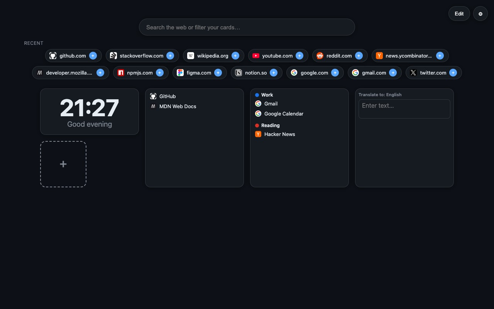

# Dialy — Speed Dial New Tab

A fast, private, beautiful new‑tab dashboard for Chrome (Manifest V3). Speed‑dial tiles,
widgets, and search in one clean page — **no ads, no tracking, completely free.**



## Features

- **Speed dial** — drag‑and‑drop tiles, resizable, with crisp icons found automatically
  (favicons, page logos, even inline SVG) and one‑click **background removal**.
- **Widgets** from a built‑in Store: **Clock**, **Notes**, **Translator** (on‑device, with
  optional cloud fallback), **Bookmarks**, **Tab groups**.
- **Top zone** — drag widgets above the search bar; reorder/resize everything in Edit mode.
- **Search** — Google / DuckDuckGo / Bing with live suggestions, or filter your tiles.
- **Recent sites** row with one‑click pinning.
- **Themes** — light / dark / gradient that follow your system; custom backgrounds.
- **5 languages** — English, Русский, Español, Deutsch, Français. Backup & restore.
- **Privacy‑first** — everything is stored locally; optional permissions are requested
  only the moment you use the feature that needs them.

## Install (unpacked)

1. `npm install && npm run build`
2. Open `chrome://extensions` and enable **Developer mode**.
3. **Load unpacked** → select the `dist/` folder.

## Development

```bash
npm install
npm run dev      # Vite dev server (a dev-only chrome shim lets it run at http://localhost:5173)
npm test         # Vitest unit/component tests
npm run build    # type-check + production build into dist/
```

## Privacy

No ads, no tracking, no analytics, no accounts. All your data lives locally in your
browser. Features that use the network — search suggestions, optional cloud translation,
and icon lookup — run only on your action and send data directly to the chosen service,
never to us. See the full [Privacy Policy](docs/PRIVACY.md).

## Tech

Preact · TypeScript · Vite ([@crxjs](https://crxjs.dev)) · Manifest V3 · SortableJS · Vitest.

## License

[MIT](LICENSE) © 2026 klimofey
